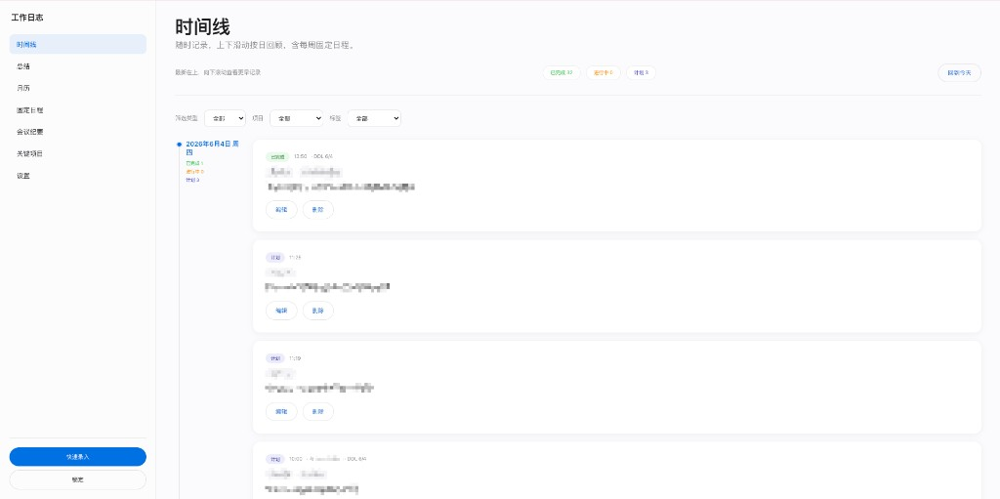
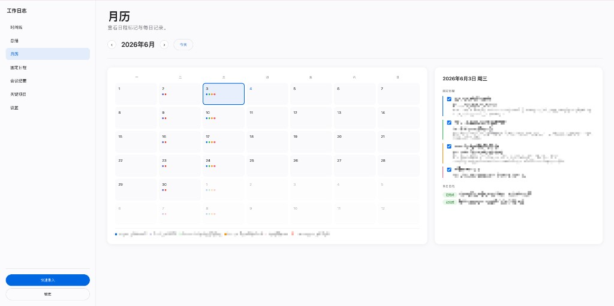

# 工作日志与总结

## 快速开始

1. 运行 `start-server.bat`（或本地 HTTP 服务），浏览器访问 http://localhost:8080
2. **首次使用**：在解锁页 **选择并导入加密备份**（`.json`），输入备份时的主密码
3. 已有本地数据时，输入主密码解锁即可

> 本应用不提供「空库初始化」；新环境须从加密备份恢复。忘记主密码无法恢复数据，请定期在「设置 → 导出加密备份」保存备份文件。

## 界面预览

### 时间线

按日浏览工作记录，支持类型 / 项目 / 标签筛选与快速录入。

### 月历

按月查看日程标记与每日记录，选中日期可查看固定日程与当日日志。

## 功能概览

- 时间线、月历、日志与固定日程
- 每日 / 每周 Markdown 总结
- 加密用户数据导入 / 导出

## 数据备份与恢复

- **导出**：应用内 **设置 → 导出加密备份**，将 `.json` 保存到安全位置
- **导入**：**设置 → 导入加密备份**，选择备份文件并用主密码解锁
- **换电脑**：在新电脑上获取项目文件后，按「快速开始」运行，再执行导入即可

## 技术栈

纯前端：HTML / CSS / JavaScript，Web Crypto API，无后端依赖。
